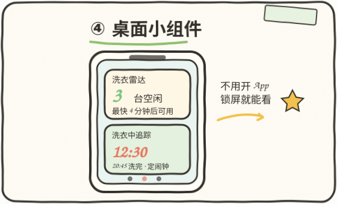

# 🧺 JSNU Laundry Radar · Haile Life Edition

[中文文档 (Chinese)](README.md) | English Documentation

<p align="center"></p>

<p align="center">
  
  
</p>
<p align="center">
  
  
</p>

<p align="center">
  
  
  
  
</p>

An Android client built on the **Haile Life (海乐生活)** campus laundry platform that turns your dorm's shared laundry room into a **live availability radar**: real-time machine states, auto-stalking for a free washer, and washer-finish notifications.

---

## 💡 Why

Students often walk up several floors only to find every washer busy, or forget to collect laundry after it finishes. This app lets you:

- **See** every washer / shoe-washer / dryer state from your dorm;
- **Stalk** a chosen laundry room — get notified the instant a machine frees up (edge-triggered, 30-min cooldown, 15s high-frequency burst after a hit);
- **Track** your own running washer — per-minute countdown and a high-priority "come collect your laundry" alert when it finishes;
- **Glance** at home-screen widgets with free-machine counts and live countdown.

## ✨ Features

- Real-time device status from the public, read-only campus laundry status API
- Derived states: `Idle` / `Reservable` / `Taken` / `Running-Locked` / `Fault`
- Smart sorting by soonest availability
- Foreground **Watch Service** with edge-triggered notifications and TTL auto-stop
- **Wash tracking** with per-minute countdown and finish alert
- Two **home-screen widgets**
- Multi-point & favourite management, onboarding, theme modes, usage stats
- Optional **Huawei AGC** anonymous auth + Cloud DB user profile (gracefully degrades)
- Optional **Umeng** analytics & push (skipped safely when unconfigured)

## 🏗️ Tech Stack

Kotlin · Jetpack Compose Material 3 · Retrofit/OkHttp · kotlinx.serialization · Coroutines/Flow · DataStore · WorkManager · Foreground Service · Huawei AGC · JUnit/Robolectric/Roborazzi.

## 🚀 Build

```bash
git clone https://github.com/xm2284/jsnu-laundry-radar.git
cd jsnu-laundry-radar
# Optional: copy app/agconnect-services.json.example -> app/agconnect-services.json
# Optional: copy local.properties.example -> local.properties (Umeng keys)
./gradlew assembleDebug
```

> Android Studio Ladybug or newer · JDK 17 · Android SDK 35.

## 🔐 Security

No credentials are hardcoded. Huawei AGC credentials and Umeng keys are externalized and git-ignored; core features keep working when they are absent. Only anonymous identifiers are used.

## ⚠️ Disclaimer

Unofficial third-party tool, not affiliated with the laundry platform or the university. It only calls public read-only status APIs. For learning and personal use only.

## 📄 License

[MIT License](LICENSE).
